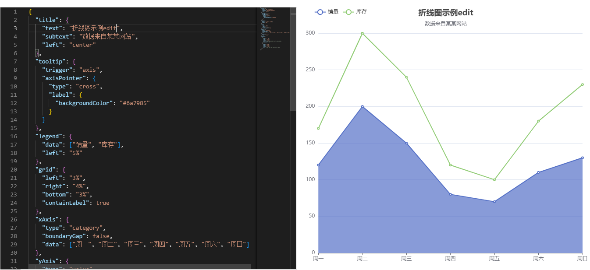

# ECharts Configuration Demo

This project is designed to help you visualize and configure ECharts. The left area is an editable configuration section, and the right area updates in real-time based on the configuration.

[国内地址gitee](https://gitee.com/felikschen/echarts-config)

## Features

- **Editable Configuration**: Modify the ECharts configuration in the left area.
- **Real-time Update**: See the changes reflected immediately in the right area.
- **Vue 3**: Built with Vue 3 for a modern development experience.
- **Vite**: Utilizes Vite for fast and efficient development and build processes.

## Project Setup

### Install Dependencies

```sh
pnpm install
pnpm start
```

## Preview
